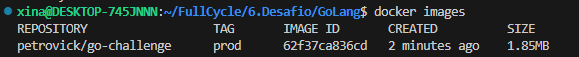

# Docker GoLang Challenge

This document refers to the first docker challenge using GoLang and Docker resulting with the smallest image possible.

### Image size



### Reviewers

To run the container please execute the following command
```
docker run petrovick/go-challenge:prod
```